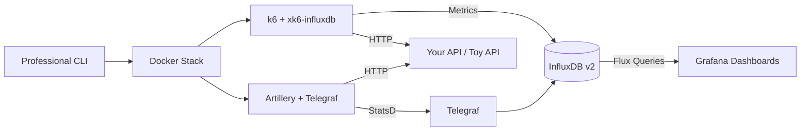

# Load Testing Lab

> **Production-ready load testing platform** with k6 + xk6-influxdb, Artillery, InfluxDB v2, and Grafana dashboards.

A complete, containerized performance testing platform for modern APIs and microservices. Test under realistic load, visualize real-time metrics, and store historical data - all with zero configuration.

---

## 🚀 Quick Start

Get running in 2 minutes:

```bash
# 1. Clone and install
git clone https://github.com/destbreso/load-testing-lab.git
cd load-testing-lab
npm install

# 2. Configure (interactive wizard)
npm run configure

# 3. Start services
npm start

# 4. Run your first test
npm run k6 -- -s toy-fast.js

# 5. View results
open http://localhost:3000  # Grafana (admin/admin123)
```

**🎓 New to load testing?** Check the [complete course at destbreso.com →](https://destbreso.com)

---

## 📖 Documentation

| Guide                                             | Description                                    |
|---------------------------------------------------|------------------------------------------------|
| **[📘 Complete Documentation](docs/README.md)**   | Master documentation hub                       |
| **[⚙️ Setup Guide](docs/SETUP.md)**               | Installation, configuration, environment setup |
| **[▶️ Usage Guide](docs/USAGE.md)**               | Running tests with k6 and Artillery            |
| **[📊 Dashboard Guide](docs/DASHBOARDS.md)**      | 6 Grafana dashboards explained                 |
| **[🔧 Troubleshooting](docs/TROUBLESHOOTING.md)** | Common issues and solutions                    |
| **[🤝 Contributing](docs/CONTRIBUTING.md)**       | How to contribute                              |
| **[📋 Changelog](docs/CHANGELOG.md)**             | Version history                                |

---

## ✨ Key Features

### 🎯 Zero Configuration
- Works out-of-the-box with sensible defaults
- Auto-configured k6 with xk6-influxdb
- Artillery + Telegraf integration via StatsD
- Grafana dashboards auto-provisioned

### 📊 Professional Dashboards
**6 production-ready Grafana dashboards:**

- **k6**: War Room, Pro, Elite (with heatmaps & percentiles)
- **Artillery**: Basic, Pro, Elite (scenario tracking)

Real-time visualization of:

- Response time (p50, p95, p99)
- Requests per second (RPS)
- Error rates and HTTP status codes
- Virtual users and concurrency
- Bandwidth and network metrics

### Professional CLI
**16 commands for streamlined testing:**

```bash
npm run configure  # Interactive setup
npm start          # Start lab
npm run k6         # Run k6 tests
npm run artillery  # Run Artillery tests
npm run restart    # Restart services
npm run rebuild    # Clean rebuild
npm run purge      # Full reset
```

**Full CLI documentation:** [cli/README.md](cli/README.md)

### 🎪 Built-in Test API
**8 realistic endpoints (Toy API):**

- `/fast` - Low latency baseline
- `/slow` - Variable latency (2-5s)
- `/error` - Controlled failures (30%)
- `/cpu` - CPU-intensive workload
- `/memory` - Memory-intensive operations
- `/workers` - Async worker simulation
- `/inspect` - Full flow inspection
- `/random` - Random latency

Test and Learn without external dependencies!

---

## Architecture



**Components:**

- **k6 + xk6-influxdb** - Modern load testing with auto InfluxDB integration
- **Artillery + Telegraf** - YAML-based testing with StatsD metrics
- **InfluxDB v2** - Time-series metrics storage
- **Grafana** - 6 professional dashboards
- **Docker Compose** - Complete containerized stack
- **Professional CLI** - 16 commands for operations
- **Toy API** - Built-in test endpoints

**[Detailed Architecture →](docs/README.md#architecture)**

---

## 🎯 Use Cases

### Who This Is For

- **Students** - Learn load testing best practices
- **Backend Engineers** - API scalability validation
- **QA Engineers** - Repeatable performance testing
- **SRE Teams** - Capacity planning and reliability
- **Startups** - Pre-launch performance validation
- **Enterprises** - CI/CD performance gates


### What You Can Test
- ✅ REST APIs, GraphQL, WebSockets
- ✅ Microservices and monoliths
- ✅ External third-party APIs
- ✅ Worker queues and async processing
- ✅ Database performance under load
- ✅ Cache effectiveness and CDN performance

---

## 🎓 Learning Resources

### Complete Course Series
**13 articles from beginner to advanced:**

🎓 **[Load Testing Course on destbreso.com →](https://destbreso.com)**

Topics covered:

- Load testing fundamentals
- k6 and Artillery mastery
- InfluxDB and Grafana visualization
- CI/CD integration
- Chaos engineering
- Performance optimization
- Real-world case studies

**Also available locally:** [`/blog`](blog/README.md) folder

---

## 📊 Project Status

| Component                | Status     | Notes                         |
|--------------------------|------------|-------------------------------|
| **k6 + xk6-influxdb**    | 🟢 Working | Auto-configured, zero setup   |
| **Artillery + Telegraf** | 🟢 Working | StatsD integration complete   |
| **InfluxDB v2**          | 🟢 Working | Time-series storage ready     |
| **Grafana**              | 🟢 Working | 6 dashboards auto-provisioned |
| **Professional CLI**     | 🟢 Working | 16 commands available         |
| **Toy API**              | 🟢 Working | 8 test endpoints              |

---

## 🤝 Contributing

Contributions welcome! This project needs:

- 🔧 New test scenarios (WebSockets, GraphQL, gRPC)
- 📊 Additional (generic) Grafana dashboards
- 🐛 Bug reports and fixes
- 📝 Documentation improvements
- 🌐 Translations

**[Contributing Guide →](docs/CONTRIBUTING.md)**

---

## 📄 License

This project is licensed under the **MIT License** - see [LICENSE](LICENSE) file.

**TL;DR:** Free to use, modify, and distribute. No warranties provided.

### Third-Party Licenses

| Tool      | License  |
|-----------|----------|
| k6        | AGPL-3.0 |
| Artillery | MPL-2.0  |
| InfluxDB  | MIT      |
| Grafana   | AGPL-3.0 |
| Telegraf  | MIT      |

---

## 🙏 Acknowledgments

Built with amazing open-source tools:

- **[k6](https://k6.io)** by Grafana Labs
- **[Artillery](https://artillery.io)**
- **[InfluxDB](https://influxdata.com)**
- **[Grafana](https://grafana.com)**
- **[Telegraf](https://influxdata.com/telegraf)**

---

## 💝 Support This Project

If this project helps you:

- ⭐ Star the repository
- 🐛 Report issues or suggest features
- 📖 Contribute documentation
- 💬 Share with others
- 📚 Read the [course on destbreso.com](https://destbreso.com)

**Made with ❤️ for the developer community**

---

**Ready to start?** → **[Setup Guide](docs/SETUP.md)** | **[Complete Documentation](docs/README.md)**

**Last Updated:** January 29, 2026
