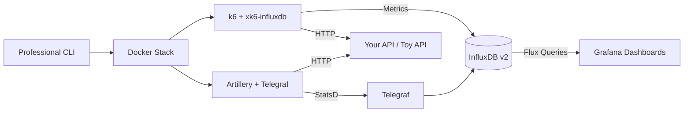

# Load Testing Lab

> **Production-ready load testing platform** with k6 + xk6-influxdb, Artillery, InfluxDB v2, and Grafana dashboards.

A complete, containerized performance testing platform for modern APIs and microservices. Test under realistic load, visualize real-time metrics, and store historical data.

**Includes everything:**
- ✅ 6 Professional Grafana dashboards
- ✅ Example k6 & Artillery scenarios  
- ✅ Toy API (8 endpoints for testing)
- ✅ Full InfluxDB v2 + Telegraf stack
- ✅ CLI with 18 commands
- ✅ **External project support** - Use your own scenarios from any folder

---

## 🚀 Quick Start

```bash
# 1. Clone and install CLI globally
git clone https://github.com/destbreso/load-testing-lab.git
cd load-testing-lab
npm install && npm link

# 2. Start the lab (InfluxDB, Grafana, Telegraf, Toy API)
ltlab start

# 3. Run tests with built-in scenarios
ltlab k6 -s toy-fast.js
ltlab artillery -s basic.yml

# 4. View dashboards
open http://localhost:3000  # Grafana (admin/admin123)
```

---

## 🎯 Using Your Own Scenarios (External Projects)

The CLI automatically detects if you're pointing to a **local file** and mounts it into the container. No need to copy files into the lab project!

### Simple Scenarios (Single File)

```bash
# From ANY directory, use your own test files
cd ~/projects/my-api

# Run your local k6 test (the CLI detects it's a local file)
ltlab k6 -s ./load-tests/stress-test.js

# Run your local Artillery test
ltlab artillery -s ./load-tests/smoke-test.yml

# You can also use absolute paths
ltlab k6 -s /Users/me/projects/payment-api/tests/checkout.js
```

### Complex Scenarios (Multiple Files, Helpers, Data)

For scenarios that import other files (helpers, data, configs), use the `-p, --project` option:

```bash
# Mount entire project directory
ltlab k6 -p ./my-tests -s main.js
ltlab artillery -p ./load-tests -s stress.yml
```

**Example structure:**
```
my-tests/
  main.js           # ← scenario (imports helpers)
  helpers.js        # ← shared functions  
  config.js         # ← configuration
  data/
    users.json      # ← test data
```

```bash
# Run with project mode
ltlab k6 -p ./my-tests -s main.js
# The entire directory is mounted, so imports work correctly
```

### Custom Grafana Dashboards

Add your own dashboards without modifying the lab:

```bash
# Link dashboards from your project (copies to lab's custom/ folder)
ltlab dashboard link ~/projects/my-api/dashboards

# Restart Grafana to load them
ltlab restart -s grafana

# List current dashboards
ltlab dashboard list

# Remove custom dashboards
ltlab dashboard unlink
```

> **Note:** Your project folder is the **source of truth**. The lab's `custom/` folder is ignored by git. To sync changes, run `link` again.

**📚 Complete guide:** [External Projects Guide](docs/EXTERNAL_PROJECTS.md)

---

## 📊 Generate New Scenarios

Create scenarios using blueprints:

```bash
# Generate in the lab's scenarios folder
ltlab generate -e k6 -n my-test

# Then run it
ltlab k6 -s my-test.js
```

Or create your own files anywhere and run them directly!

**🎓 New to load testing?** Check the [complete course at destbreso.com →](https://destbreso.com)

---

## 📖 Documentation

| Guide                                                       | Description                                    |
|-------------------------------------------------------------|------------------------------------------------|
| **[📘 Complete Documentation](docs/README.md)**             | Master documentation hub                       |
| **[🎯 External Projects Guide](docs/EXTERNAL_PROJECTS.md)** | **NEW** - Use with your own projects           |
| **[⚙️ Setup Guide](docs/SETUP.md)**                         | Installation, configuration, environment setup |
| **[▶️ Usage Guide](docs/USAGE.md)**                         | Running tests with k6 and Artillery            |
| **[📊 Dashboard Guide](docs/DASHBOARDS.md)**                | 6 Grafana dashboards explained                 |
| **[🔧 Troubleshooting](docs/TROUBLESHOOTING.md)**           | Common issues and solutions                    |
| **[🤝 Contributing](docs/CONTRIBUTING.md)**                 | How to contribute                              |
| **[📋 Changelog](docs/CHANGELOG.md)**                       | Version history                                |

---

## ✨ Key Features

### 🎯 Zero Configuration
- Works out-of-the-box with sensible defaults
- Auto-configured k6 with xk6-influxdb
- Artillery + Telegraf integration via StatsD
- Grafana dashboards auto-provisioned

### 📊 Professional Dashboards
**6 production-ready Grafana dashboards:**

- **k6**: War Room, Pro, Elite (with heatmaps & percentiles)
- **Artillery**: Basic, Pro, Elite (scenario tracking)

Real-time visualization of:

- Response time (p50, p95, p99)
- Requests per second (RPS)
- Error rates and HTTP status codes
- Virtual users and concurrency
- Bandwidth and network metrics

### Professional CLI
**18 commands for streamlined testing:**

```bash
ltlab configure   # Interactive setup
ltlab start       # Start lab
ltlab k6          # Run k6 tests (supports external files)
ltlab artillery   # Run Artillery tests (supports external files)
ltlab generate    # Generate scenarios from blueprints
ltlab dashboard   # Manage custom Grafana dashboards
ltlab restart     # Restart services
ltlab rebuild     # Clean rebuild
ltlab purge       # Full reset
```

**External project support:**
```bash
ltlab k6 -s ./local-file.js              # Auto-detect local files
ltlab k6 -p ./my-project -s main.js      # Mount project with helpers
ltlab dashboard link ./my-dashboards     # Link external dashboards
```

**Full CLI documentation:** [cli/README.md](cli/README.md)

### 🎪 Built-in Test API
**8 realistic endpoints (Toy API):**

- `/health` - Health check
- `/fast` - Instant response (~10ms)
- `/slow` - Variable latency (500-2500ms)
- `/error` - Random failures (30% failure rate)
- `/cpu` - CPU-intensive workload
- `/io` - Simulated I/O operations (300-1500ms)
- `/users` - JSON dataset (50 users)
- `/jobs` - Async job creation + status

Test and Learn without external dependencies!

---

## Architecture



**Components:**

- **k6 + xk6-influxdb** - Modern load testing with auto InfluxDB integration
- **Artillery + Telegraf** - YAML-based testing with StatsD metrics
- **InfluxDB v2** - Time-series metrics storage
- **Grafana** - 6 professional dashboards
- **Docker Compose** - Complete containerized stack
- **Professional CLI** - 16 commands for operations
- **Toy API** - Built-in test endpoints

**[Detailed Architecture →](docs/README.md#architecture)**

---

## 🎯 Use Cases

### Who This Is For

| User Type             | Use Case                                                      |
|-----------------------|---------------------------------------------------------------|
| **Students**          | Learn load testing best practices with full code access       |
| **QA Engineers**      | Run tests with custom scenarios from external project folders |
| **Backend Engineers** | Validate API scalability, keep tests in your API project      |
| **DevOps/SRE Teams**  | CI/CD integration with external scenario management           |
| **Startups**          | Quick setup for pre-launch performance validation             |
| **Enterprises**       | Centralized lab, distributed test scenarios per team          |
| **Contributors**      | Extend platform, add features, fix bugs                       |

### External Projects vs Built-in Scenarios

| Feature          | Built-in Scenarios                             | External Projects                      |
|------------------|------------------------------------------------|----------------------------------------|
| **Location**     | Inside `k6/scenarios/`, `artillery/scenarios/` | Any folder on your system              |
| **Command**      | `ltlab k6 -s toy-fast.js`                      | `ltlab k6 -s ./my-test.js`             |
| **With helpers** | N/A                                            | `ltlab k6 -p ./my-project -s main.js`  |
| **Dashboards**   | In `grafana/dashboards/`                       | `ltlab dashboard link ./my-dashboards` |
| **Best For**     | Learning, quick tests                          | Real projects, team workflows          |

**📚 See [External Projects Guide](docs/EXTERNAL_PROJECTS.md) for complete examples.**


### What You Can Test
- ✅ REST APIs, GraphQL, WebSockets
- ✅ Microservices and monoliths
- ✅ External third-party APIs
- ✅ Worker queues and async processing
- ✅ Database performance under load
- ✅ Cache effectiveness and CDN performance

---

## 🎓 Learning Resources

### Complete Course Series
**13 articles from beginner to advanced:**

🎓 **[Load Testing Course on destbreso.com →](https://destbreso.com)**

Topics covered:

- Load testing fundamentals
- k6 and Artillery mastery
- InfluxDB and Grafana visualization
- CI/CD integration
- Chaos engineering
- Performance optimization
- Real-world case studies

**Also available locally:** [`/blog`](blog/README.md) folder

---

## 📊 Project Status

| Component                | Status     | Notes                           |
|--------------------------|------------|---------------------------------|
| **k6 + xk6-influxdb**    | 🟢 Working | Auto-configured, zero setup     |
| **Artillery + Telegraf** | 🟢 Working | StatsD integration complete     |
| **InfluxDB v2**          | 🟢 Working | Time-series storage ready       |
| **Grafana**              | 🟢 Working | 6 dashboards auto-provisioned   |
| **Professional CLI**     | 🟢 Working | 18 commands available           |
| **External Projects**    | 🟢 Working | Mount scenarios from any folder |
| **Custom Dashboards**    | 🟢 Working | Link/copy external dashboards   |
| **Toy API**              | 🟢 Working | 8 test endpoints                |

---

## 🤝 Contributing

Contributions welcome! This project needs:

- 🔧 New test scenarios (WebSockets, GraphQL, gRPC)
- 📊 Additional (generic) Grafana dashboards
- 🐛 Bug reports and fixes
- 📝 Documentation improvements
- 🌐 Translations

**[Contributing Guide →](docs/CONTRIBUTING.md)**

---

## 📄 License

This project is licensed under the **MIT License** - see [LICENSE](LICENSE) file.

**TL;DR:** Free to use, modify, and distribute. No warranties provided.

### Third-Party Licenses

| Tool      | License  |
|-----------|----------|
| k6        | AGPL-3.0 |
| Artillery | MPL-2.0  |
| InfluxDB  | MIT      |
| Grafana   | AGPL-3.0 |
| Telegraf  | MIT      |

---

## 🙏 Acknowledgments

Built with amazing open-source tools:

- **[k6](https://k6.io)** by Grafana Labs
- **[Artillery](https://artillery.io)**
- **[InfluxDB](https://influxdata.com)**
- **[Grafana](https://grafana.com)**
- **[Telegraf](https://influxdata.com/telegraf)**

---

## 💝 Support This Project

If this project helps you:

- ⭐ Star the repository
- 🐛 Report issues or suggest features
- 📖 Contribute documentation
- 💬 Share with others
- 📚 Read the [course on destbreso.com](https://destbreso.com)

**Made with ❤️ for the developer community**

---

**Ready to start?** → **[Setup Guide](docs/SETUP.md)** | **[Complete Documentation](docs/README.md)**

**Last Updated:** February 2, 2026
